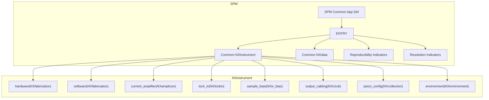

# Application Definition for SPM Domain

# Plan for General SPM App Def

<h1>Graphical View</h1>
<table>
  <!-- Row -->
  <tr class=0>
    <!-- coloum -->
    <td style="background:red; color:black;">(00)</td>
    <td style="background:green;  color:black;">(01)</td>
    <td style="background:white;  color:black;">(02)</td>
    <td style="background:yellow;  color:black;">(03)</td>
  </tr>
  <tr class=1>
    <!-- coloum -->
    <td style="background:red; color:black;">(10)</td>
    <td style="background:green;  color:black;">(11)</td>
    <td style="background:white;  color:black;">(12)</td>
    <td style="background:yellow;  color:black;">(13)</td>
  </tr  <tr class=2>
    <!-- coloum -->
    <td style="background:red; color:black;">(20)</td>
    <td style="background:green;  color:black;">(21)</td>
    <td style="background:white;  color:black;">(22)</td>
    <td style="background:yellow;  color:black;">(23)</td>
  </tr>
  <tr class=3>
    <!-- coloum -->
    <td style="background:red; color:black;">(30)</td>
    <td style="background:green;  color:black;">(31)</td>
    <td style="background:white;  color:black;">(32)</td>
    <td style="background:yellow;  color:black;">(33)</td>
  </tr>
</table>

